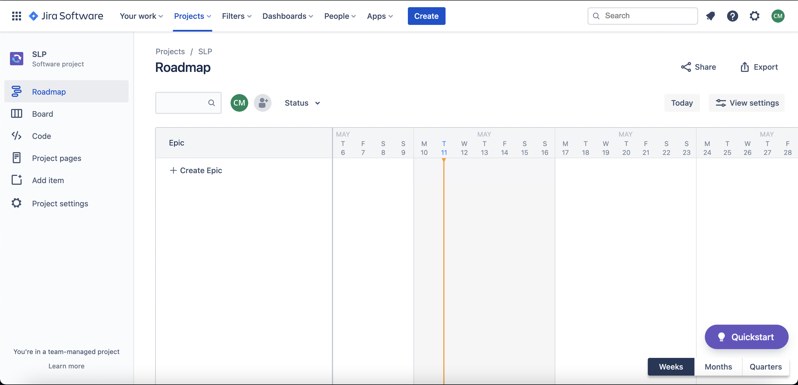
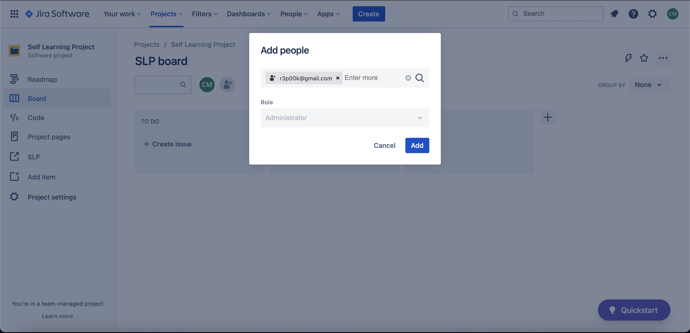
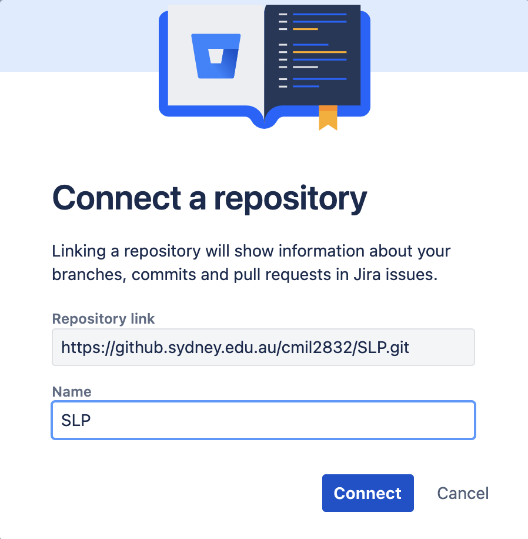
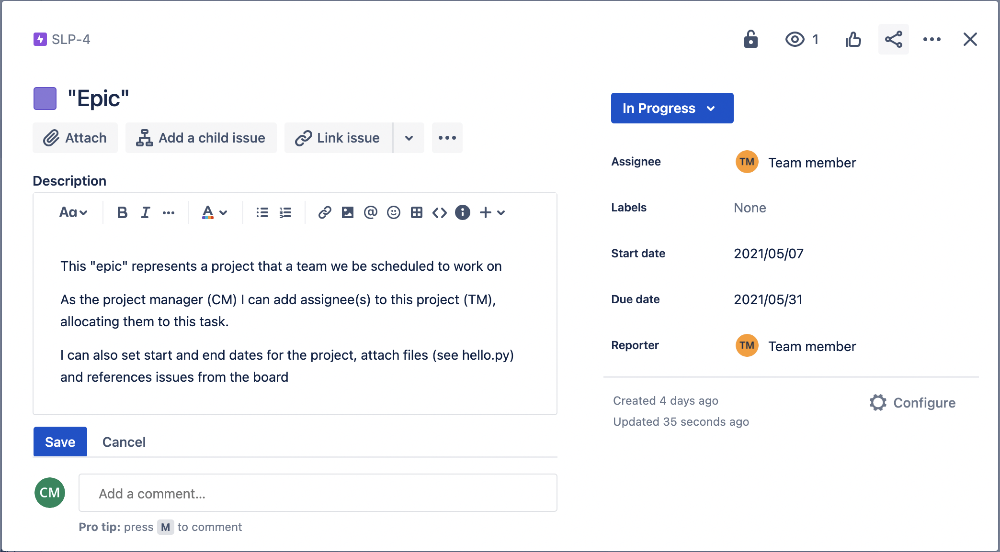
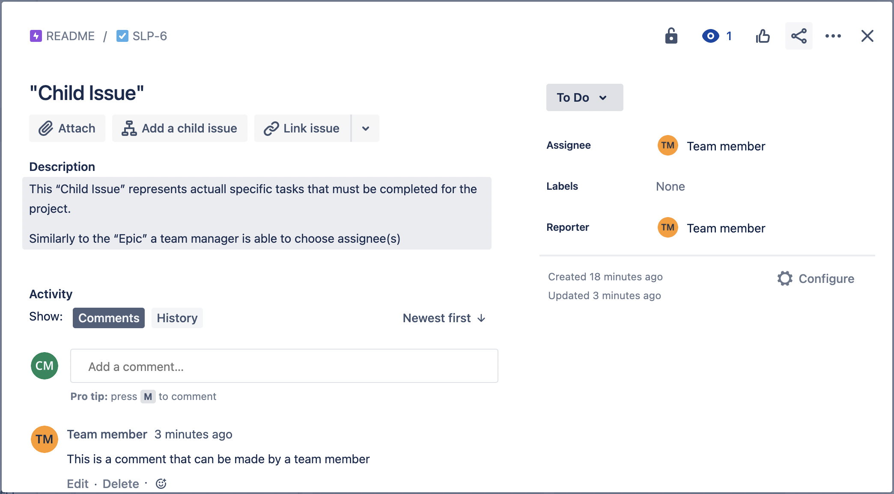
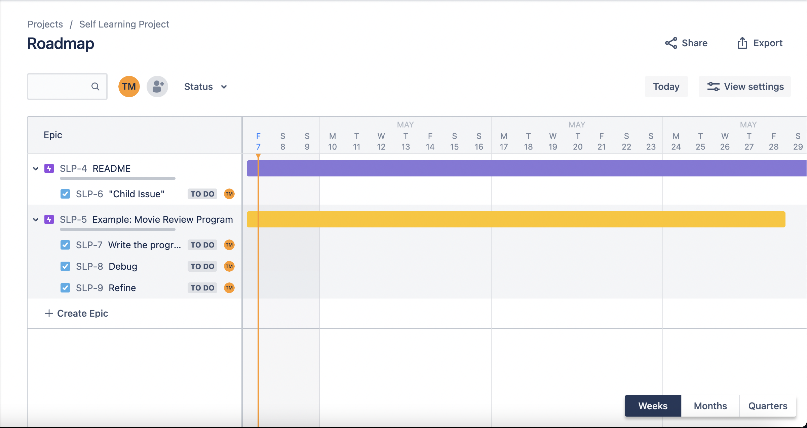
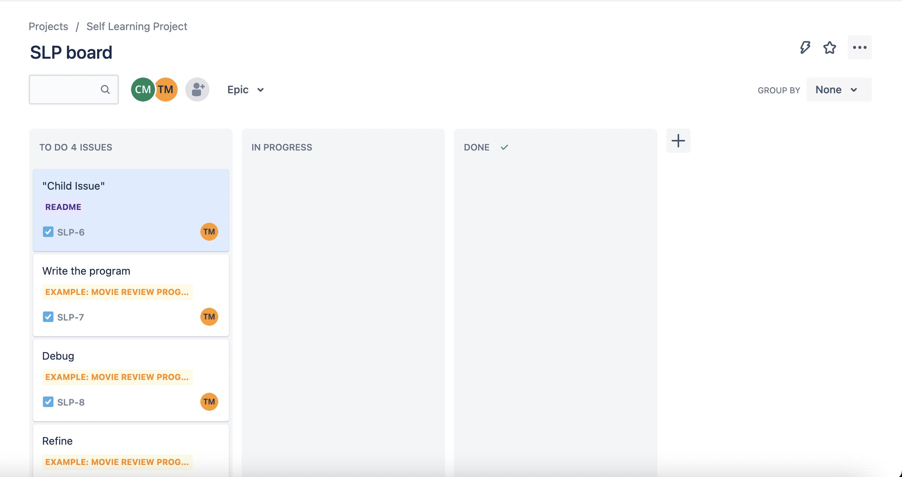
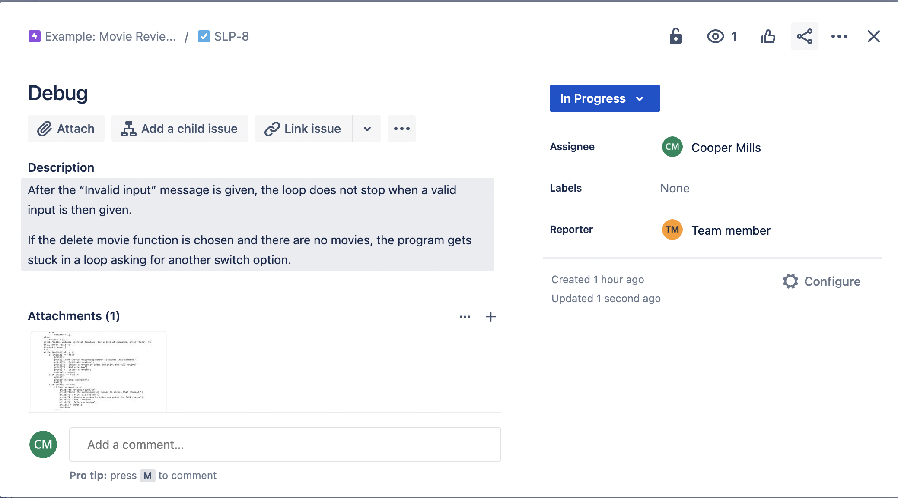
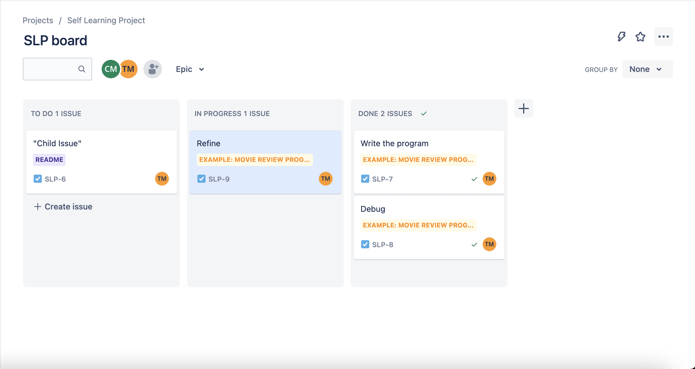
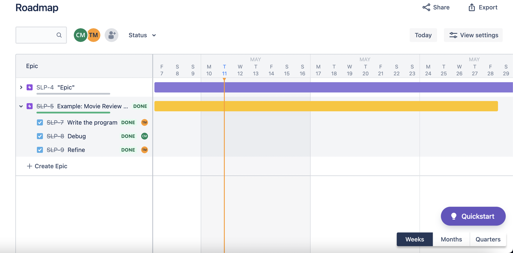

This PDF will contain all relevant photos to my Level 1 Artifact along with descriptions to help outline what I have learnt so far.  
\
\
\
\
\
\

*Figure-1*  
\
This image shows a blank roadmap of a new Jira Project that I have just created. From here I am now able to set up my Project and start adding team members, creating tasks, adding Git Repositories, etc.  
\
On the left there is a toolbar. On this toolbar there are a few useful links for me. Firstly, the page titled "Roadmap", which is currently shown, "Board" which is the project board with all relevant tasks (see below for demonstration of its function) and "Add item" which is used to link Git Repositories.  
\
\
\

*Figure-2*  
\
Using the "Add People" button from the Roadmap shown in figure 1, I can now use this window shown above to add team members to my project by email or name.    
\ 
\
\
{width=50%}  
*Figure-3*
\
Next, using the toolbar on the Roadmap page, I am now able to add my Git Repository using the "Add Item" button. I can now link my repository using the url as shown above in figure 3.
\
\
\
{width=90%}  
*Figure-4*
\
Then, from the Roadmap page, clicking on the "+ Create Epic" button will allow me to create a new project. Once it has been named I can edit the details of the project in the manner shown above. Where I can change the title and description to add detail to the project. I can assign certain team member(s) to the project, set a start and end date attach files and link it to other projects and tasks.
\
\
\
{width=90%}  
*Figure-5*
\
From the screen in Figure 4, I am now able to create a "Child Issue" using the middle button on the top left. These represent the individual tasks that make up the overall project. Seen above in Figure 5, they have the same layout as an "Epic". Such that they can have a name and description, be assigned to certain team member(s), have files attached and be linked to other projects/tasks. However, unlike projects they cannot have a set start/end date as they are linked to the timeline of the overall project.
\
\
\

*Figure-6*
\
Now that the roadmap is complete, it will look something like in the figure above.
\
\
\

*Figure-7*
\
Next, heading over to the "Board" I will now able to see all the tasks for the team that were made for the projects (see figure above). These tasks will sit in three different columns based on their progress. "To Do", "In Progress" and "Done". They can be moved between these stages by dragging their icons.
\
\
\

*Figure-8*
\
Above is an example for one of these tasks from my mock project which shows the details described from Figure 5, the title and description, an attached Python file, and an assignee. When the task is in different stages of progress, it can be changed by using the button on the top right. This will start to move around the tasks through diffferent stages. An example of this is shown below.
\
\
\

*Figure-9*
\
Here the tasks are mimicking a team that is concurrently working on a project, whereby each task is being completed in order to complete a larger overall project.
\
\
\

*Figure-10*
\
Finally, once all tasks have been flagged as "Done", back on the roadmap the project will have a green progress bar to indicate that all tasks are completed. Now, a team leader is able to set the progress of the whole project to "Done" putting a strike through the name to idicate that the project has been completed, as shown above.
\
\
\
\
Thus, Figure 1-10 above are all relevant examples of the process of Jira through the eyes of a potential professional team using the software. These figures represent this process, from setting up the domain all the way through to finishing the given project.